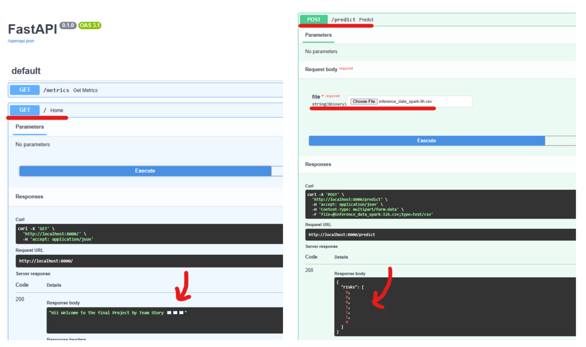

# Project on Docker, Prometheus and Grafana

*Note*: It is highly recommended to use a virtual environment for running the code. Requirements are given in the `./app/requirements.txt` file

# Assignment on Docker, Prometheus and Grafana

*Note*: It is highly recommended to use a virtual environment for running the code. Requirements are given in the `./app/requirements.txt` file

## ✅Easy Direct Usage✅

Simply run the following command

``` bash
docker compose up
```


The three containers and their respective ports are given at:
* FastAPI: http://localhost:8000/
* Prometheus: http://localhost:9090/
* Grafana: http://localhost:3000/

> The main code is the `app/main.py` file


# ✨Task-wise pointers✨

## ✨Data (pre)processing pipeline implemented via Apache Spark✨
- The Preprocessing code has been implemented in Pyspark. All code can be found in the `/app/utils/` directory. The `TrainingUtils` class contains all methods for processing such as imputing missing values, renaming columns as necessary etc.

## Github Repo
- The project was contributed by 3 authors. All of us had multiple commits, pushes, and a pull request. 
- We created new branches and merged them into the main branch whenever considerable changes were made or bugs were fixed
- Release notes of **Version 1 of the app** and the corresponding **.whl** file are also available


## MlFlow
- We utilsed MLFlow in two stages: (a) to get the best performing model, and (b) to search for the best hyperparameters 


### 📱Testing via other devices📱
- Opened the command prompt from Windows and ran `ipconfig`. Under the Wireless LAN adapter Wi-Fi, I got my IPv4 Address as `192.168.0.3`
- From another device connected to the same network, I typed the url : `http://192.168.0.3:8000.`
- Could acccess and test my API with this endpoint


### ⚓Setting up Docker⚓
- Wrote the DockerFile, docker-compose file, other yml files properly and setup the containers using
```bash
$ docker compose up --build # for the first time
# OR
$ docker compose # for subsequent runs, building is not necessary so this works fine
```
- Port mapping is taken care of by the docker-compose file, and the respective yml files for grafana and prometheus. As mentined above, the three containers and their respective ports are given at:
    * FastAPI: http://localhost:8000/
    * Prometheus: http://localhost:9090/
    * Grafana: http://localhost:3000/
- Setting up CPU utilsation is done by adding the `cpus` option in the compose file. We set it to 1. The image below shows how only 1 cpu is utlised


# 📸Snapshots📸

## ⏩FastAPI⏩




## 🐎Prometheus🐎
> Note: These are the custom metrics and gauges


## 🌞Grafana🌞


### 🔴Checking Boundary Conditions🔴
- We check the boundary conditions for the correctness of the input data

### 😁 Code-cleanliness! 😁
- Type hints from the typing module are leveraged
- All code is pep-8 style formatted using ruff, isort and black as pre-commit hooks

### References
- Documentation for Prometheus, Grafana and FastAPI
